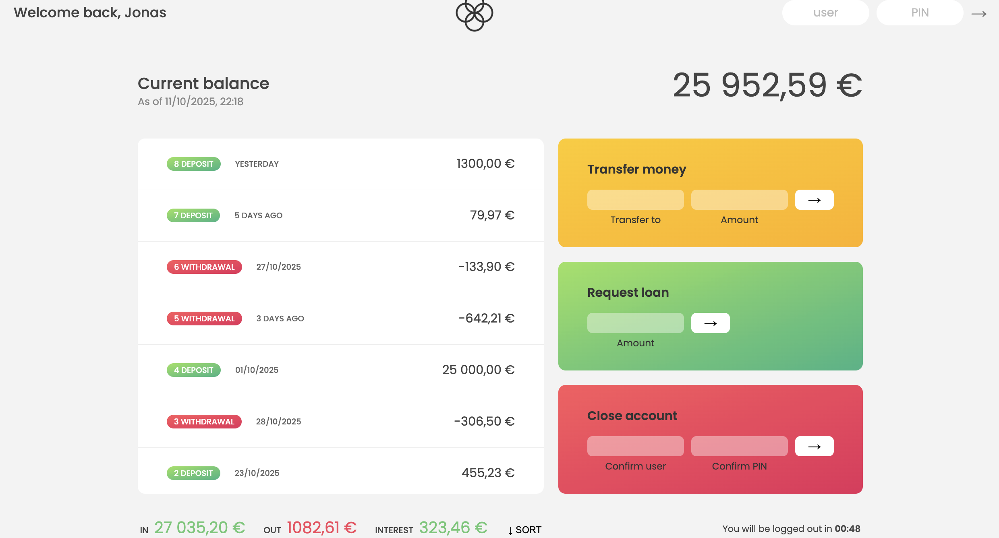

# Children's Bank

A modern, interactive **banking web application** built in **JavaScript **.  
It simulates real-world online banking — allowing users to **log in**, **view balances**, **make transfers**, **request loans**, and **close accounts** — all with localized **currency** and **date formatting**.

---

## Overview

The Bankist App provides a realistic banking experience where multiple user accounts exist with their own currencies, locales, and transaction histories.  
Users can securely log in using their credentials (username + PIN) and perform common banking operations in a fully dynamic UI.

---

## Demo Accounts ----> Use these Usernames to login and make transfers to each other

| Username | Owner             | PIN  | Currency | Locale |
| -------- | ----------------- | ---- | -------- | ------ |
| `js`     | Jessica Davis     | 2222 | USD      | en-US  |
| `jd`     | Jonas Schmedtmann | 1111 | EUR      | pt-PT  |

---

## Core Functionalities

### 1. Login System

- Each user logs in using a **unique username** and **PIN**.
- The interface displays a **personalized welcome message**.
- The app shows **localized date and time** using the `Intl.DateTimeFormat` API.
- After login, an **automatic logout timer** starts for security.

---

### 2. Displaying Account Movements

- Displays all **deposits** and **withdrawals** dynamically.
- Each movement is shown with:
  - **Type** (`deposit` or `withdrawal`)
  - **Formatted Date** (using locale settings)
  - **Formatted Amount** (currency & locale aware)
- Option to **sort** movements in ascending order.

---

### 3. Balance and Summary Calculations

- **Total Balance** — calculated using `.reduce()`.
- **Summary Section** displays:
  - **Total Incomes** (sum of all deposits)
  - **Total Outgoings** (sum of all withdrawals)
  - **Interest Earned** (based on each deposit and account’s interest rate)
- All values are **formatted** using `Intl.NumberFormat`.

---

### 4. Money Transfer

- Transfer money between existing accounts.
- Validations ensure:
  - The receiver exists.
  - The sender has enough balance.
  - The sender cannot transfer to themselves.
- Transfer is **instantaneous** and records a **timestamp** in ISO format.

---

### 5. Loan Request

- A user can request a **loan** if any deposit is at least **10%** of the requested amount.
- The loan is **granted after a short delay (2.5 seconds)** using `setTimeout()` to simulate real-world bank processing time.
- Upon approval:
  - The loan amount is added to movements.
  - A movement date is recorded.
  - The UI updates automatically.

---

### 6. Account Closure

- Allows users to **delete their own account** permanently.
- Validated through **username and PIN** verification.
- Once deleted:
  - The account is removed from the `accounts` array.
  - The UI is hidden (simulating logout).

---

### 7. Auto Logout Timer

- For security, the app logs out automatically after **60 seconds of inactivity**.
- Timer updates every second.
- When time runs out:
  - The app hides the interface.
  - The welcome message resets to the login prompt.

---

### 8. Currency Formatting

- All monetary values (movements, summaries, balances) are displayed with proper **currency symbols** and **locale-specific formatting**.
- Implemented using `Intl.NumberFormat`.

---

## Technologies & Features Used

| Category                 | Details                                                                      |
| ------------------------ | ---------------------------------------------------------------------------- |
| **Language**             | JavaScript (ES6)                                                             |
| **DOM Manipulation**     | `querySelector`, `insertAdjacentHTML`, dynamic updates                       |
| **Date & Time Handling** | `Date`, `Intl.DateTimeFormat`, `toISOString()`                               |
| **Currency Formatting**  | `Intl.NumberFormat`                                                          |
| **Timers**               | `setInterval()`, `setTimeout()`, auto logout timer                           |
| **Array Methods**        | `map()`, `filter()`, `reduce()`, `find()`, `findIndex()`, `some()`, `sort()` |
| **Event Handling**       | `addEventListener()` for form actions                                        |
| **Security Simulation**  | Logout timer, PIN verification                                               |
| **Modern Syntax**        | Arrow functions, optional chaining (`?.`), destructuring                     |

---

